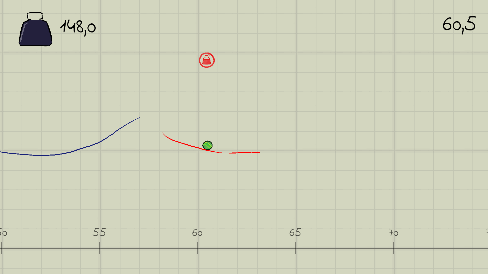

# 画线物理小球 (Ludum Dare 45)

## URL
https://github.com/nirvana233/LudumDare_45

https://www.bilibili.com/video/BV17T411p7NM/?p=1&vd_source=3702316b7234ff2c3a3ccb9f95a4c4eb

## 描述
一款2D物理游戏，通过画线，让小球在线上滚动。

## 线渲染器
划线用的LineRenderer，同时上面需要有Edge Collider。LineRenderer随着时间推移尾部逐渐消失，尾部带一点透明度渐变。同时下面的进度条也是用的LineRenderer

## 画线逻辑
ScreenToWorldPoint转世界坐标，点增加到LineRenderer和Edge Collider上面

## 相机跟随
相机插值到球的位置周围

## 背景循环
背景是平铺的，可以取模，相机移动到一定位置之后，背景局部坐标就移动一定单位，因为是平铺的，视觉上是不会有变化的，却保证了背景的循环

## 小球
可以增加爆发力
持续力
初始速度
无重力等

## 红线
增加碰撞点的切线方向的持续力，切线的计算方式看代码（法线反着来，(-y,x), 或者通过矩阵）

## PowerUpJump
增加该物体的Up方向上的爆发力

## BallBehaviour
增加小球速度方向的爆发力

